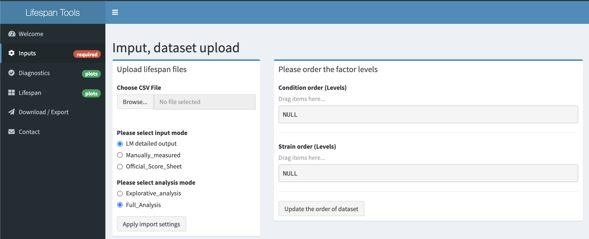
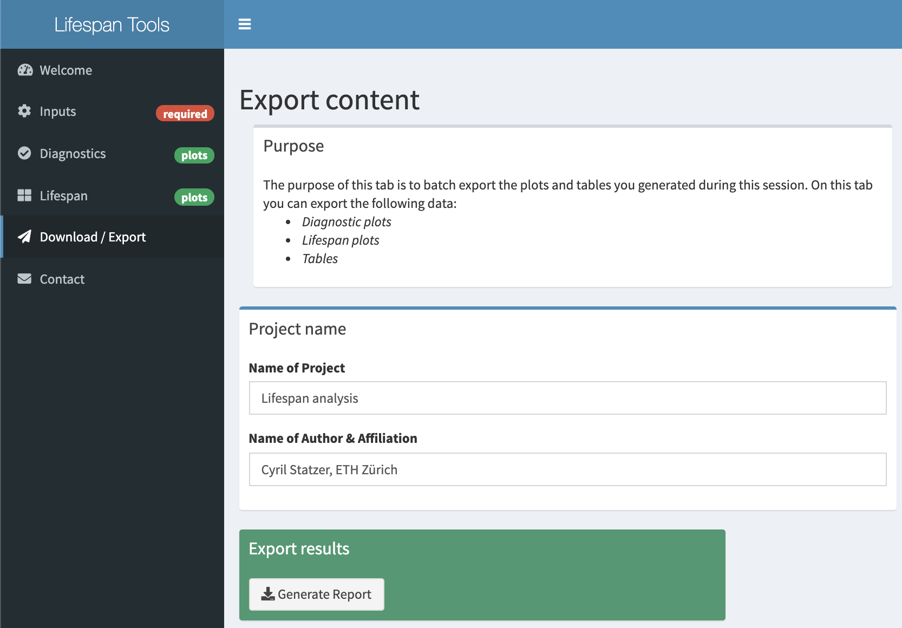

# Lifespan analysis tool

Interactive analysis tool to analyze, visualize and perform statistical tests on lifespan datasets. The tool is compatible with manually measured as well as automatically acquired datasets. Diagnostic features allow the identification of batch effects.

## Available resources
- [Tool](http://ce-matrisome-annotator.permalink.cc) to interactively analyze datasets.

## Setup
1. Clone repository.
2. Install needed packages (under development).
3. Run App (using [RStudio](https://rstudio.com)).

## App preview

### Importing lifespan datasets

### Export lifespan report
